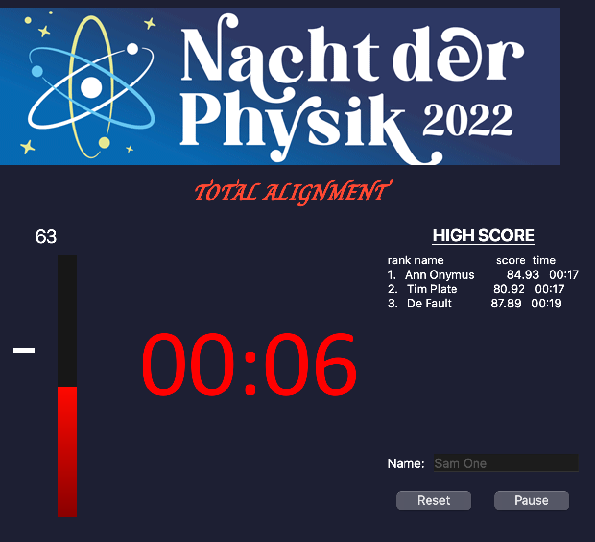

# Alignment Game: "Total Alignment"
A game consisting of a laser alignment challenge, with a GUI for setting up, starting, and displaying the power meter as players try to align an optical setup.

  

Originally developed for the "Nacht der Physik 2022" event at ETH Zürich 17 July 2022, the project includes the GUI and a backend for connecting to the acquisition card and detector.

## Usage

Palyers or teams enter their name and click on "start" to start the challenge. The timer will start to count down towards zero. The goal of the game is to reach the given power threshold as fast as possible. If the timer runs out, the players are ranked according to hthe ighest power score achieved.

Currently, the power scale and the power threshold are set in the source code.

## Dependencies

This project uses PyQt6 and matplotlib.
